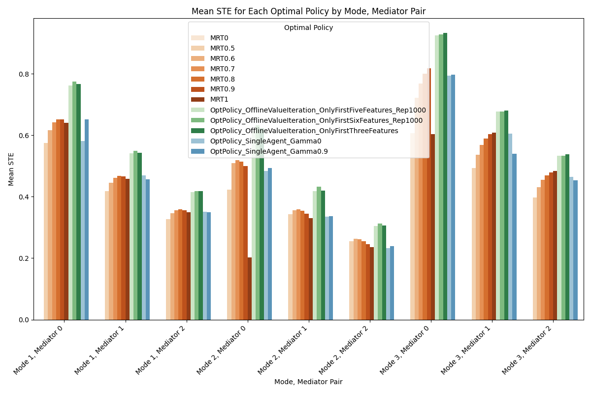

## Running experiments and analysis to test the optimal policy

The code in this directory was used to test various candidates for the optimal policy approximation. The candidates we try are: micro-randomized interventions with fixed probabilities, a linear approximation of Q values using the single agent's frozen theta parameters, and offline fitted Q-learning on a dataset generated by a random policy. We test each candidate under mediator effect in $[0,1,2]$ and various values of $C_{\text{Treat}_0}$, $C_{\text{Treat}_1}$, $C_{\text{Treat}_2}$, $C_{\text{Treat}_3}$.

Directions:

1. Make sure you are in the root of the directory, i.e. `cd ADAPTS-HCT-RL-Algorithm-Design`.
2. Run `python Experiment_Test_Opt_Policy/scripts/generate_experiment_config.py` to create the config files for the eperiments, which will be stored in `Experiment_Test_Opt_Policy/configs/design_decisions/Test_STE_All.json`. In the python file, you can also change the algorithms to run, the values of $C_{\text{Treat}_0}$ and $C_{\text{Treat}_0}$ to test, and the values of mediator effect values.
3. Run `sh Experiment_Test_Opt_Policy/scripts/submit_jobs.sh`to submit the jobs for experiments. The resulting CSV files from the experiments will be stored in `Experiment_Test_Opt_Policy/results`.
4. Run all cells in the notebook `Experiment_Test_Opt_Policy/analysis.ipynb` to visualize the results (and produce the plot shown below).

