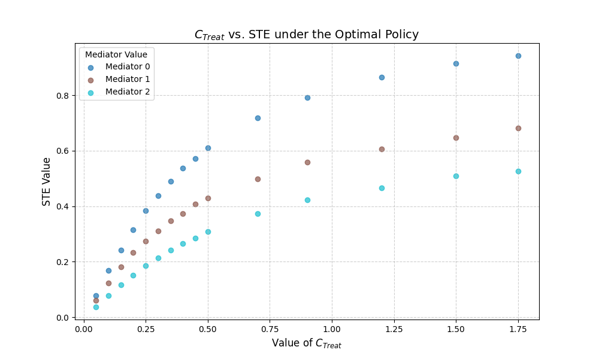

## Running experiments and analysis to tune the hyperparameter

The code in this directory was used to tune the hyperparameter $C_\text{Treat}$. Specifically, it runs the optimal policy approximation* and the no-action policy for each possible environment where value of mediator effect in $[0,1,2]$ and $C_\text{Treat}$ in $[0.05,0.1,0.15,0.2,0.25,0.3,0.35,0.4,0.45,0.5,0.7,0.9,1,1.2,1.5,1.75,2,3]$. Then, we choose the value of $C_\text{Treat}$ such that it satisfies STE = $[0.15, 0.3, 0.5]$ for each of the mediator effect values.

Directions:

1. Make sure you are in the root of the directory, i.e. `cd ADAPTS-HCT-RL-Algorithm-Design`.
2. Run `python Experiment_Tune_Ctreat/scripts/generate_experiment_config.py` to create the config files for the eperiments, which will be stored in `Experiment_Tune_Ctreat/configs/design_decisions/Tune_Ctreat.json`. In the python file, you can also change the algorithms to run, the values of $C_\text{Treat}$ to test, and the values of mediator effect values 4
3. Run `sh Experiment_Tune_Ctreat/scripts/submit_jobs.sh`to submit the jobs for experiments. The resulting CSV files from the experiments will be stored in `Experiment_Tune_Ctreat/results`.
4. Run all cells in the notebook `Experiment_Tune_Ctreat/analysis.ipynb` to visualize the results (and produce the plot shown below).

*Note that the approximation of optimal policy we use here is offline value iteration using the first six features of the state.
